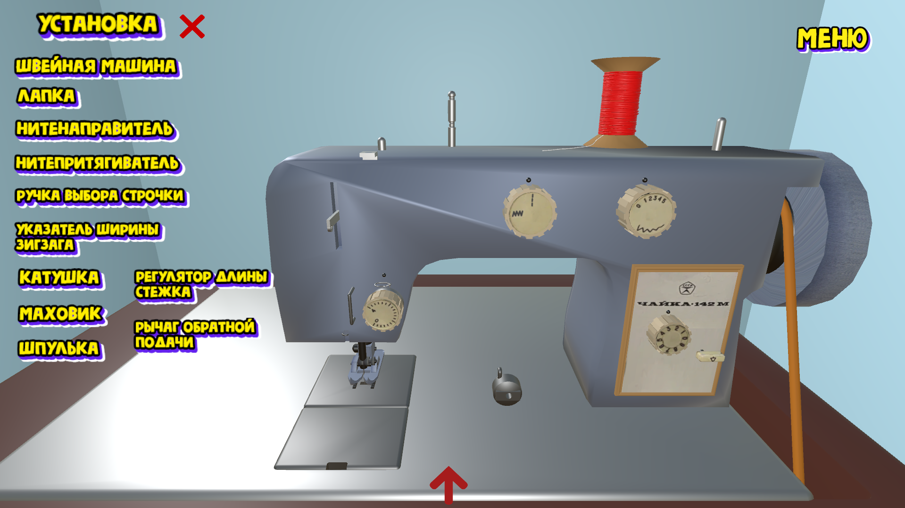

# ✂️ Симулятор швейной машинки

## 📌 Описание
Интерактивное приложение, разработанное на Unity, которое имитирует работу бытовой швейной машины в 3D-среде. Проект позволяет пользователям знакомиться с элементами оборудования, выбирать ткань и нити, выполнять обводку, обрезку и сшивание заготовок. Симулятор предназначен для начинающих, которые хотят освоить основы работы с швейной машинкой безопасно и без использования реального оборудования. <br><br>
Проект был разработан в качестве индивидуального проекта для диплома по специальности **«Информационные системы и технологии»**. Полное описание проекта расположенно в папке `doc/`.

## 🚀 Установка и запуск
1. Склонировать репозиторий:
   ```bash
   git clone https://github.com/username/sewing-machine-simulator.git

2. Открыть проект в Unity Hub (версии 2021.3 LTS или новее).
3. Импортировать все зависимости (будут подтянуты автоматически).
4. Запустить сцену SampleScene через Unity Editor или собрать проект в Build.

## 🎮 Управление
| Действие                          | Управление / Элемент интерфейса |
|-----------------------------------|---------------------------------|
|Описание пошаговой работы симулятора| Кнопка вопросительного знака |
| Перемещение по мастерской         | **W / A / S / D**               |
| Поворот камеры                    | **ПКМ (удерживать)** + мышь     |
| Выход в главное меню              | **Меню**                         |
| Запуск/остановка шитья            | **Пробел**                      |
| Выбор ткани и трафарета           | Панель **Инвентарь** (нижняя часть экрана) |
| Добавление предметов              | Клик ЛКМ по элементу инвентаря  |
| Перетаскивание материалов         | Drag & Drop мышью               |
| Просмотр элементов машинки        | Панель **Установка** (игла, лапка, маховик) |
| Смена цвета нитей                 | Панель выбора цвета ниток       |
| Выполнение обрезки ткани          | Инструмент **Ножницы** (иконка в интерфейсе) |
| Смена типа строчки                | Кнопки выбора на машинке: прямая / зигзаг  |
| Настройка звука                   | Меню **Настройки** → слайдер громкости |
| Полноэкранный / оконный режим     | Меню **Настройки** → кнопка переключения |

## 🖼️ Скриншоты
| Главное меню                  | Рабочая зона                       | Швейная машинка                  |
| ----------------------------- | ---------------------------------- | -------------------------------- |
|  |  |  |

## 🛠️ Технологии
- Unity – игровой движок
- C# – язык программирования
- 3ds Max – моделирование 3D-объектов
- Photoshop – работа с текстурами

## 📜 Лицензия
Этот проект распространяется под лицензией [MIT](https://github.com/Korelo-Kseniya/Simulator-sewing-machine/blob/main/LICENSE). 

## 📬 Контакты
Автор проекта: **Корело К.А.**  
- ✉️ Email: korelo.ks@gmail.com  
- 🌐 Telegram: (https://t.me/Korelo_Kseniya)
